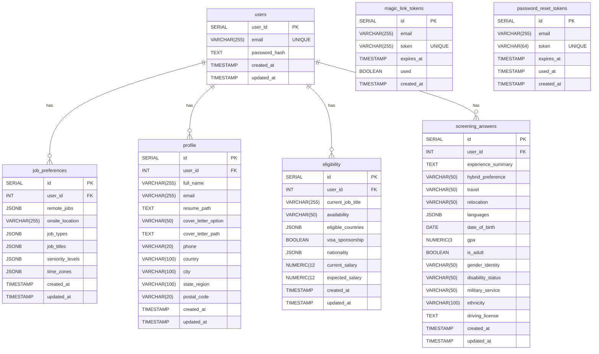

# Database Schema Architecture

## Overview

The Auto-Apply platform uses a **normalized database schema** with separate tables for different data domains, combined with a VIEW that provides a unified interface for reading complete user profiles.

## Data Flow Diagram

```
┌─────────────────────────────────────────────────────────────────┐
│                         WIZARD FRONTEND                          │
│                      (User fills 3 steps +                       │
│                      screening questions)                        │
└────────┬────────────────┬────────────────┬─────────────┬────────┘
         │                │                │             │
         │ POST /step1    │ POST /step2    │ POST /step3 │ POST /screening
         ▼                ▼                ▼             ▼
┌────────────────┐ ┌────────────┐ ┌─────────────┐ ┌──────────────────┐
│ JobPreferences │ │  Profile   │ │ Eligibility │ │ ScreeningAnswers │
│     Model      │ │   Model    │ │    Model    │ │      Model       │
└────────┬───────┘ └─────┬──────┘ └──────┬──────┘ └────────┬─────────┘
         │               │               │                  │
         │ .upsert()     │ .upsert()     │ .upsert()       │ .upsert()
         ▼               ▼               ▼                  ▼
┌────────────────┐ ┌────────────┐ ┌─────────────┐ ┌──────────────────┐
│job_preferences │ │  profile   │ │ eligibility │ │screening_answers │
│     TABLE      │ │   TABLE    │ │    TABLE    │ │      TABLE       │
└────────┬───────┘ └─────┬──────┘ └──────┬──────┘ └────────┬─────────┘
         │               │               │                  │
         └───────────────┴───────────────┴──────────────────┘
                                 │
                        LEFT JOIN operations
                                 │
                                 ▼
                  ┌──────────────────────────┐
                  │  user_complete_profile   │
                  │          VIEW            │
                  │   (READ-ONLY INTERFACE)  │
                  └─────────────┬────────────┘
                                │
                       GET /api/wizard/data
                                │
                                ▼
                  ┌──────────────────────────┐
                  │    User.getCompleteProfile()    │
                  │    Returns unified data   │
                  └──────────────────────────┘
```

**Key Points:**
- **Write Operations** → Go directly to individual TABLES
- **Read Operations** → Go through the VIEW which aggregates table data
- **VIEW** → Does NOT store data, just provides a query interface

## Entity Relationship Diagram

The following ER diagram shows the database structure, including all tables, their columns, and relationships:




**Key:**
- **PK**: Primary Key
- **FK**: Foreign Key
- **||--o{**: One-to-many relationship
- **||--||**: One-to-one relationship


## Current Architecture

### Separate Tables (Normalized Design)

The wizard data is stored in **four separate tables**:

1. **`job_preferences`** - Step 1 data
   - Remote/onsite preferences
   - Job types, titles, seniority levels
   - Time zones

2. **`profile`** - Step 2 data
   - Full name, email, phone
   - Resume and cover letter paths
   - Location information

3. **`eligibility`** - Step 3 data
   - Current job title
   - Availability
   - Visa sponsorship status
   - Salary expectations

4. **`screening_answers`** - Screening questions
   - Languages
   - Disability status
   - Gender identity
   - Military service
   - Other demographic and screening data

### The `user_complete_profile` VIEW

The `user_complete_profile` is a **PostgreSQL VIEW** (not a table) that:
- JOINs all four tables above with the `users` table
- Provides a unified interface for reading complete user profiles
- Does NOT store any data itself - it's just a query

```sql
CREATE OR REPLACE VIEW user_complete_profile AS
SELECT
    u.user_id,
    u.email,
    jp.*,     -- job_preferences columns
    p.*,      -- profile columns
    e.*,      -- eligibility columns
    sa.*      -- screening_answers columns
FROM users u
LEFT JOIN job_preferences jp ON u.user_id = jp.user_id
LEFT JOIN profile p ON u.user_id = p.user_id
LEFT JOIN eligibility e ON u.user_id = e.user_id
LEFT JOIN screening_answers sa ON u.user_id = sa.user_id;
```

## Wizard Step to Table Mapping

Each step in the wizard corresponds to a specific database table:

| Wizard Step | API Endpoint | Model | Database Table | Data Stored |
|------------|--------------|-------|----------------|-------------|
| **Step 1** | `POST /api/wizard/step1` | `JobPreferences` | `job_preferences` | Remote/onsite preferences, job types, titles, seniority, time zones |
| **Step 2** | `POST /api/wizard/step2` | `Profile` | `profile` | Name, email, phone, resume path, cover letter, location |
| **Step 3** | `POST /api/wizard/step3` | `Eligibility` | `eligibility` | Job title, availability, visa sponsorship, nationality, salary |
| **Screening** | `POST /api/wizard/screening` | `ScreeningAnswers` | `screening_answers` | Languages, disability status, gender, military service, demographics |
| **Get All** | `GET /api/wizard/data` | `User` | `user_complete_profile` VIEW | Complete unified profile (read-only) |

**Important Notes:**
- Each POST endpoint writes to its specific table using the model's `upsert()` method
- The GET endpoint reads from the VIEW, which automatically aggregates all tables
- You **cannot** write directly to `user_complete_profile` (it's read-only)
- All write operations use INSERT ... ON CONFLICT DO UPDATE (upsert pattern)

## How Data is Saved

### Write Operations (INSERT/UPDATE)

Each wizard step and the screening questions write to their **specific table**:

- **POST /api/wizard/step1** → `JobPreferences.upsert()` → `job_preferences` table
- **POST /api/wizard/step2** → `Profile.upsert()` → `profile` table
- **POST /api/wizard/step3** → `Eligibility.upsert()` → `eligibility` table
- **POST /api/wizard/screening** → `ScreeningAnswers.upsert()` → `screening_answers` table

### Read Operations (SELECT)

The application reads from the VIEW for a complete profile:

- **GET /api/wizard/data** → `User.getCompleteProfile()` → `user_complete_profile` VIEW

This means:
- ✅ **Writes go to specific tables** (normalized storage)
- ✅ **Reads come from the VIEW** (denormalized access)

## Why This Appears Confusing

When you query `user_complete_profile` and see screening data (languages, disability_status, etc.), it **looks like** the data is stored in `user_complete_profile`. However:

1. `user_complete_profile` is a VIEW, not a table
2. The screening data you see in the VIEW is actually sourced from the `screening_answers` table
3. The VIEW simply makes it **appear** as one unified structure

## Verification Steps

### To verify data is in `screening_answers`:

```sql
SELECT user_id, languages, disability_status, gender_identity, military_service
FROM screening_answers
WHERE user_id = 2;
```

If this returns data, it's in the `screening_answers` table.

### To verify the VIEW is working:

```sql
SELECT user_id, languages, disability_status, gender_identity, military_service
FROM user_complete_profile
WHERE user_id = 2;
```

This should return the **same data** as the query above, because the VIEW joins from `screening_answers`.

### To check if user_complete_profile is a VIEW or TABLE:

```sql
SELECT table_name, table_type
FROM information_schema.tables 
WHERE table_schema = 'public' 
AND table_name = 'user_complete_profile';
```

Expected result: `table_type = 'VIEW'`

## Common Misconceptions

### ❌ INCORRECT: "The wizard saves data to user_complete_profile table"

The wizard saves data to **separate tables** (`job_preferences`, `profile`, `eligibility`, `screening_answers`). The `user_complete_profile` VIEW aggregates this data for reading.

### ✅ CORRECT: "The wizard saves data to separate tables, and user_complete_profile provides a unified read interface"

## Benefits of This Architecture

1. **Normalization** - No data duplication
2. **Separation of concerns** - Each table has a specific purpose
3. **Easy updates** - Update one table without affecting others
4. **Unified reads** - The VIEW provides easy access to complete profiles
5. **Performance** - Can index and optimize each table independently

## Schema Evolution Options

If the schema were to evolve to a single table:

### Option 1: Convert VIEW to TABLE (NOT RECOMMENDED)

This would require:
- Dropping the VIEW
- Creating a new TABLE with all columns
- Updating all models to write to the single table
- Migrating existing data
- **Major breaking changes**

### Option 2: Keep Current Architecture (RECOMMENDED)

The current architecture is:
- ✅ Properly normalized
- ✅ Well-tested
- ✅ Working correctly
- ✅ Easy to maintain

**No changes needed.**

## Troubleshooting

### If screening_answers table appears empty:

1. Check if data was actually submitted from the frontend
2. Verify the API endpoint is receiving the data
3. Check server logs for errors during upsert
4. Run the verification query above

### If user_complete_profile shows no data:

1. Verify the underlying tables have data
2. Check if the user_id exists in the users table
3. The VIEW uses LEFT JOINs, so missing data in one table is normal

## Related Files

- Schema definition: `database/schema.sql`
- Models: `src/database/models/`
- Routes: `src/routes/wizard.js`
- Verification script: `scripts/verify-screening-schema.js`
